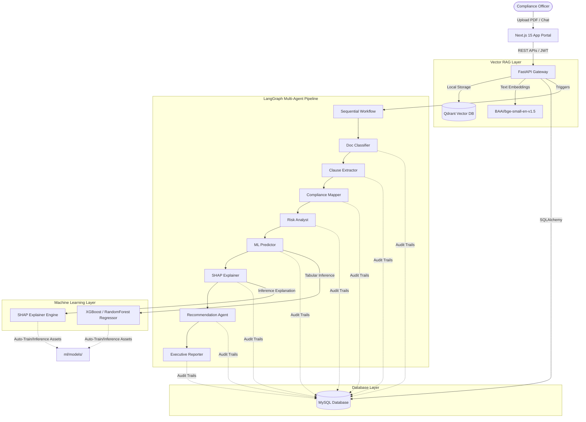
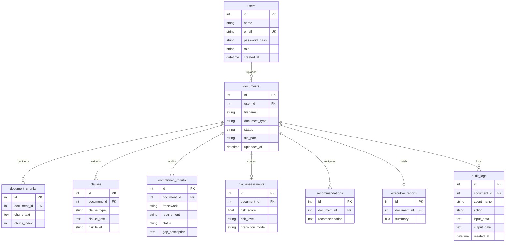

# AI Compliance Risk Copilot

AI Compliance Risk Copilot is an enterprise-grade Governance, Risk, and Compliance (GRC) platform that parses regulatory files, contracts, and legal agreements to extract clauses, audit regulatory alignment, calculate predictive risk indices, and generate C-suite executive summaries.

---

## Architecture Overview



### Relational Database Schema



---

## Tech Stack

- **Frontend**: Next.js 15, TypeScript, Tailwind CSS, Zustand, React Query, Lucide Icons, Recharts.
- **Backend API**: FastAPI, Uvicorn, Pydantic Settings, SQLAlchemy ORM, PyMySQL.
- **Relational DB**: MySQL (local schema `ai_compliance`).
- **Vector DB**: Qdrant (client-embedded storage in `backend/qdrant_db`).
- **Embeddings**: `BAAI/bge-small-en-v1.5` loaded locally via `sentence-transformers` on CPU/GPU.
- **LLM Engine**: Ollama running Llama 3.1 (`llama3.1:latest`).
- **AI Agent Framework**: LangGraph, LangChain.
- **Machine Learning**: Scikit-Learn, XGBoost, SHAP.

---

## Environment Setup & Installation

### Prerequisite Checklist
1. **Ollama** installed and running on `localhost:11434`.
   - Download the model: `ollama pull llama3.1`
2. **MySQL Server** installed and running on `localhost:3306`.
   - Ensure you have a root account or configured user matching the connection details.

### 1. Backend Setup
1. Open a terminal in the `backend/` directory:
   ```bash
   cd backend
   ```
2. Activate the virtual environment:
   - Windows PowerShell:
     ```powershell
     .\venv\Scripts\Activate.ps1
     ```
   - Windows Command Prompt:
     ```cmd
     .\venv\Scripts\activate.bat
     ```
3. Verify that packages are installed. (They are auto-installed in the virtual environment).
4. Run the database creation and seeding script:
   ```bash
   python seed.py
   ```
   *This automatically creates the MySQL database `ai_compliance`, generates all table schemas, and seeds default credentials:*
   - **Admin User**: `admin@compliance.com` / Password: `admin123`
   - **Analyst User**: `analyst@compliance.com` / Password: `analyst123`
5. Run the ML Model Training pipeline:
   ```bash
   $env:PYTHONPATH=".."
   python ml/training/train.py
   ```
   *This generates 10,000 synthetic GRC risk rows, evaluates RandomForest, XGBoost, and SVR regressors, and saves the best model and SHAP explainability assets.*

### 2. Frontend Setup
1. Open a terminal in the `frontend/` directory:
   ```bash
   cd frontend
   ```
2. Install npm dependencies:
   ```bash
   npm install
   ```
3. Start the Next.js local development server:
   ```bash
   npm run dev
   ```
   *The client portal will be listening at `http://localhost:3000`.*

---

## Running the Application

### 1. Launch Backend API
In the `backend/` directory with the virtual environment activated, start the Uvicorn server:
```bash
uvicorn app.main:app --reload --host 127.0.0.1 --port 8000
```
API docs will be available at `http://localhost:8000/docs`.

### 2. Launch Frontend Portal
In the `frontend/` directory, start Next.js dev server:
```bash
npm run dev
```
Open `http://localhost:3000` in your browser. Log in with:
- Email: `analyst@compliance.com`
- Password: `analyst123`

---

## Verification & Testing
To run the automated test suite verifying MySQL connection, XGBoost risk predictions, SHAP calculations, local Qdrant collection vectors, and LangGraph agent runs:
```bash
# In the workspace root directory:
$env:PYTHONPATH="D:\ML,NLP,DL\AI Compliance Risk Copilot"
backend\venv\Scripts\python verify_system.py
```
